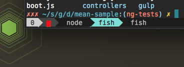
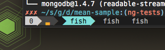
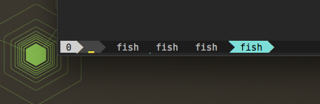

tmux-cpu-info
=============

Shows a tiny bar in your tmux statusline with the current CPU usage. Works on OSX, might work on other platforms.

Example
=======

**High Usage**



**Medium Usage**



**Low Usage**



Could also show memory usage with some slight customization.

Installation
============

Add the following to `~/.tmux.conf`

```
set -g status-left '#(tmux-cpu-info)'
```

Or for a more complete statusline like [the one I have](https://github.com/dickeyxxx/dotfiles/blob/master/home/.tmux.conf)

Also check out [tmux-spotify-info](https://github.com/dickeyxxx/tmux-spotify-info)
